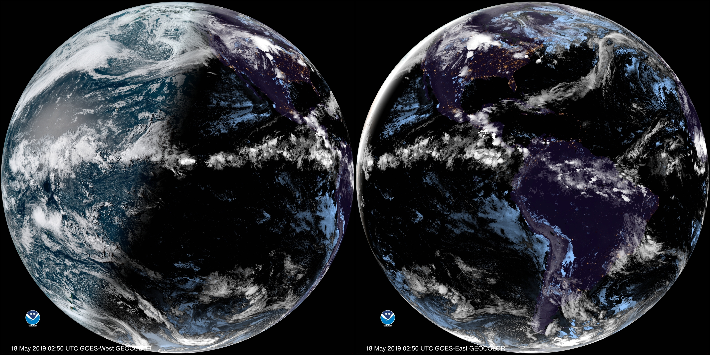

# GOESImage

GOESImage is a bash script which downloads the latest imagery from the [NOAA Geostationary Operational Environment Satellites][1] and sets it as the desktop background via [feh][2].

## Usage

    $ goesimage -h
    Usage: goesimage [OPTION...]
    Download the latest image from a NOAA Geostationary Operational Environment Satellite and set it as the desktop background.

    If multiple satellite are specified, the latest image will be downloaded from each and combined into a single, tiled image.

    Options:
        -e      GOES-East
        -w      GOES-West
        -s      Specify the desired image size:
                    small (678x678),
                    medium (5424x5424, default),
                    large (1808x1808),
                    xlarge (10848x10848)
        -h      display usage

GOESImage supports full disk, true color images from either [GOES-West][3] (currently provided by [GOES-17][4]) or [GOES-East][5] (currently provided by [GOES-16][6]). At night the images are colored multispectral infrared.

Optionally, both satellites may be specified. In this case GOESImage will use [ImageMagick convert][7] to combine the two images horizontally.

## Systemd

An example systemd service and timer are provided in the `systemd/` directory.

## Inspiration

The inspiration for GOESImage is [himawaripy](https://github.com/boramalper/himawaripy/), which provides a similar but more featureful interface to the [Himawari 8][8] Japanese weather satellite, concentrating on the Asia-Pacific region.

## Package

Arch Linux users may install the [goesimage package from the AUR][9]

[1]: https://www.star.nesdis.noaa.gov/GOES/index.php
[2]: https://feh.finalrewind.org/
[3]: https://www.star.nesdis.noaa.gov/GOES/fulldisk.php?sat=G17
[4]: https://en.wikipedia.org/wiki/GOES-17
[5]: https://www.star.nesdis.noaa.gov/GOES/fulldisk.php?sat=G16
[6]: https://en.wikipedia.org/wiki/GOES-16
[7]: https://imagemagick.org/script/convert.php
[8]: https://en.wikipedia.org/wiki/Himawari_8
[9]: https://aur.archlinux.org/packages/goesimage/
